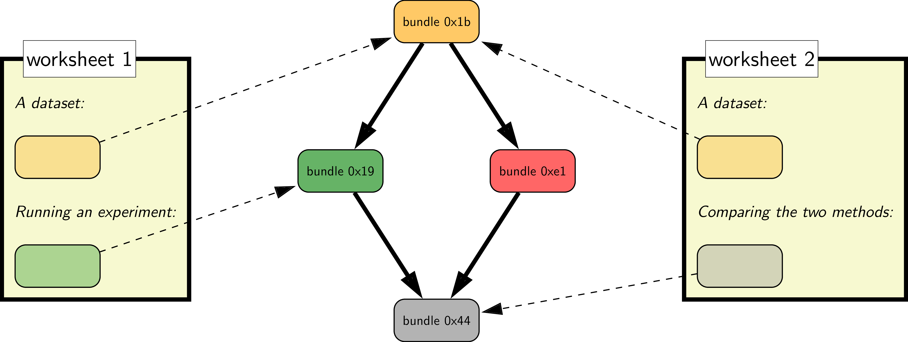
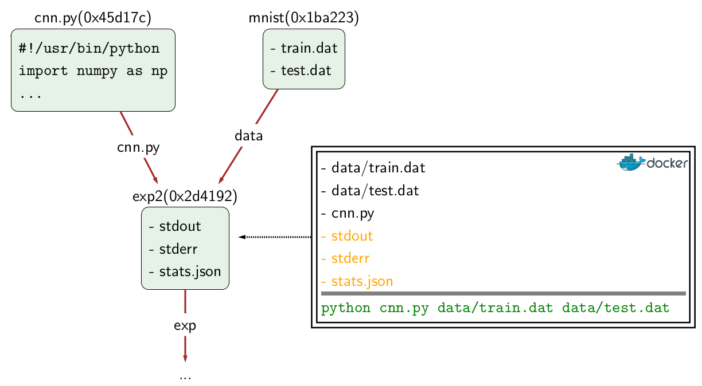

To dive in, check out the [latest features](Worksheet-Features), go through the [tutorial](User_CodaLab-Worksheets-Tutorial), [install the CLI](User_Install-CodaLab-CLI), view the [worksheet markdown reference](User_Worksheet-Markdown), or go to the [official CodaLab Worksheets instance](https://worksheets.codalab.org).

## **Why CodaLab Worksheets?**

While there has been tremendous progress in machine learning, data science, natural language processing, computer vision, and many other data- and computation-intensive fields, the research process is far from optimal.  Most of the time, the output of research is simply a PDF file (published paper).  Even when people release their data and code (which is a big step forward), it is often not obvious how to run it to obtain the results in a paper.  Simply put:

> ***Today, researchers spend excrutiating amounts of time reproducing published results.***

The goal of CodaLab Worksheets is to fix this in order to both accelerate the rate of research and make it more sound.

## **How does CodaLab Worksheets work?**

> ***CodaLab keeps the full provenance of an experiment, from raw data to the graph that you put in your paper.***

There are two important concepts in CodaLab: ***bundles*** and ***worksheets***.

- Users upload ***bundles***, which are datasets in any format or programs in
  any programming language).  They can also create new run bundles by executing
  shell commands that *depend* on the contents of previous bundles.
  This forms a graph over bundles that captures the research
  process in an *immutable* way.
- Users create ***worksheets*** to present the information in a comprehensible
  way, which contain pointers to the bundles.  Worksheets are written in a custom [markdown
  language](https://github.com/codalab/codalab/wiki/User_Worksheet-Markdown).

The figure below shows the dependency graph over four bundles, along with two worksheets,
which contain both text and pointers to the bundles:

A run bundle is specified by a set of bundle dependencies and an arbitrary shell command.
This shell command is executed in a [docker container](https://www.docker.com) in a directory
with the dependencies.  The contents of the run bundle are the files/directories which are
written to the current directory by the shell command:

## **How do I learn more?**

* [CodaLab Worksheets Tutorial](User_CodaLab-Worksheets-Tutorial): start here to learn how to create bundles and worksheets.
* [Installing the CodaLab CLI](User_Install-CodaLab-CLI): if you want to use CodaLab from the comfort of your own shell.

* [Workflow](User_Workflow): how to use CodaLab in your daily research.
* [Creating Executable Papers](Executable-Papers): how to put your paper on CodaLab.

* [Advanced CLI features](User_CLI): learn how to be an expert CodaLab user.
* [Execution](Execution): learn more about how bundles are executed in docker.
* [CodaLab Worksheet Markdown Reference](User_Worksheet-Markdown): learn how to display tables of results and images in your worksheet.
* [Setting up a Local Server](Setup-Local-Worksheets): if you want to run a CodaLab server for your own group.

### For Developers

* [Database Migrations](Dev_CodaLab-CLI-Database-Migrations)
* [Unit Tests](Dev_CodaLab-CLI-Unit-Tests)

## **Where do I report bugs?**

CodaLab is under active development.  If you find `bugs` or have feature
requests, please file a GitHub issue:

- [for the website](https://github.com/codalab/codalab-worksheets/issues/new)
- [for the command-line interace](https://github.com/codalab/codalab-cli/issues/new)

