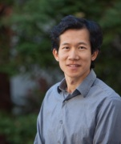
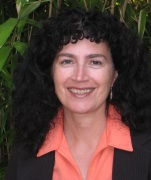
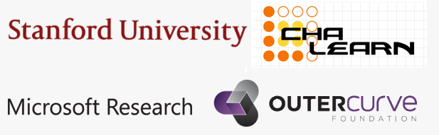

# About CodaLab
CodaLab is an open-source platform that provides an ecosystem for conducting computational research in a more efficient, reproducible, and collaborative manner.  There are two aspects of CodaLab:
worksheets and competitions.

_Worksheets_ allow you to capture complex research pipelines in a reproducible way and create "executable papers". Use any data format or programming language — great for the power user!

_Competitions_ bring together the entire community to tackle the most challenging data and computational problems today. You can win prizes and also create your own competition.

On GitHub:
- [CodaLab website](https://github.com/codalab/codalab)
- [CodaLab backend](https://github.com/codalab/codalab-cli)

## The CodaLab Team
<table>
    <tr>
        <td width=200px></td>
        <td>
<a href="http://cs.stanford.edu/%7Epliang/">Percy Liang</a> is an assistant professor of Computer Science at Stanford University. His primary research areas are machine learning and natural language processing.  He leads the development of CodaLab in close collaboration with Microsoft Research and the rest of the community.
</td>
    </tr>

    <tr>
        <td width=200px></td>
        <td>
<a href="http://www.clopinet.com/isabelle/">Isabelle Guyon</a> is an independent consultant, specializing in statistical data analysis, pattern recognition and machine learning. Isabelle served as an advisor in the development of the CodaLab competition platform and pioneered the implementation of several challenges on Codalab.
</td>
    </tr>

    <tr>
        <td width=200px></td>
        <td>
<a href="http://research.microsoft.com/~evelynev/">Evelyne Viegas</a> is a Director at Microsoft Research responsible for the outreach artificial intelligence program. She leads the CodaLab project working in collaboration with Isabelle Guyon, Percy Liang and the machine learning and artificial intelligence communities.
</td>
    </tr>
</table>

# Acknowledgments
CodaLab has received the attention and contribution from many people. They all have contributed to making CodaLab what it is today. We would like to thank all the people below and starting by acknowledging the following people who helped us pioneer CodaLab from the competition early features where Simon Mercer and Christophe Poulain played a crucial role in the development of competition functions for medical imaging to Shaunak Kishore who was instrumental in bringing the vision of worksheets to reality. 
Lori Ada Kilty, Xavier Baro Sole, Eric Camichael, Justin Carden, Richard Caruana, Francis Cleary, Sergio Escalera, Ivan Judson, Shaunak Kishore, Pragnya Maduskar, Simon Mercer, Arthur Pesah, Christophe Poulain, Lukasz Romaszko, Paul Viola, Erick Watson, Michael Zyskowski

