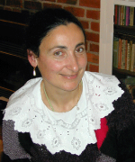
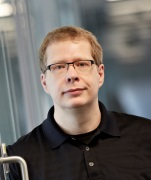

# About CodaLab
CodaLab is an open-source web-based platform where researchers and data scientists can stage competitions and conduct data-driven computational experiments. The goal of CodaLab is to create a collaborative ecosystem for conducting data- and computation-intensive research in an efficient and reproducible manner.

On GitHub:
- [CodaLab website](https://github.com/codalab/codalab)
- [CodaLab backend](https://github.com/codalab/codalab-cli)

## The CodaLab Team
<table>
    <tr>
        <td width=200px></td>
        <td>
<a href="http://cs.stanford.edu/%7Epliang/">Percy Liang</a> is an assistant professor of Computer Science at Stanford University. His primary research areas are machine learning and natural language processing.  He leads the development of CodaLab in close collaboration with Microsoft Research and the rest of the community.
</td>
    </tr>

    <tr>
        <td width=200px></td>
        <td>
<a href="http://www.clopinet.com/isabelle/">Isabelle Guyon</a> is an independent consultant, specializing in statistical data analysis, pattern recognition and machine learning. Isabelle served as an advisor in the development of the CodaLab competition platform and pioneered the implementation of several challenges on Codalab.
</td>
    </tr>

    <tr>
        <td width=200px></td>
        <td>
Simon Mercer is a Director at Microsoft Research with responsibility for healthcare-related projects, and guided the development of the competition functions in CodaLab.
</td>
    </tr>

    <tr>
        <td width=200px></td>
        <td>
Evelyne Viegas is a Director at Microsoft Research. She focuses on information and knowledge seen as an enabler of innovation. She works in the area of computational intelligence and creates programs to unleash the power of data and drive open innovation via agile experimentation and cloud-based services. She leads the Machine Learning community effort for CodaLab.
</td>
    </tr>
</table>

