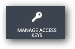
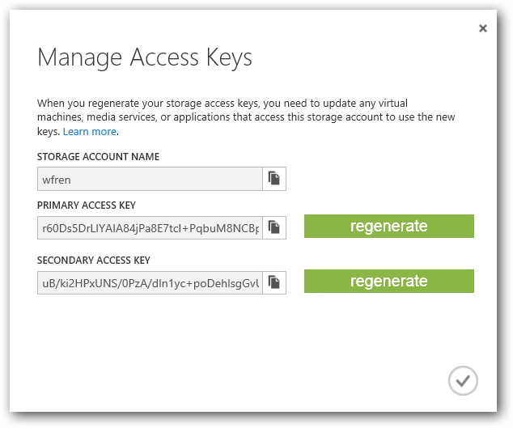

# Create an Azure Account
Data for all CodaLab competitions and worksheets is stored on Microsoft Azure. Follow these steps to create a Microsoft Azure account. If you already have a Windows Azure account you can skip ahead to [Configure Azure Storage](#configure-azure-storage).

1. Go to Windows Azure.
1. Sign in with your Windows Live credentials.
1. Click Sign Up for Windows Azure.
1. Follow the steps to create an account. Note that Azure offers a 90-day free trial.

# Configure Azure Storage
In CodaLab competitions, data is hosted in Microsoft Azure Blob Service.

**To Set up Storage for a Competition**

1. [Create a Storage Account](http://www.windowsazure.com/en-us/manage/services/storage/how-to-create-a-storage-account/).
1. [Add a Microsoft Azure Storage Container](http://technet.microsoft.com/en-us/library/hh495450.aspx)
1. Copy the endpoint URL and key for your storage container. You will need this for uploading competition data, and for creating your manifest files. To do this, navigate to the dashboard for your storage account and click the **MANAGE ACCESS KEYS** button at the bottom of the page.

This will display the **Manage Access Keys** dialog.

For more information about getting your storage account name and account key, see [How to: View, copy, and regenerate storage access keys](http://azure.microsoft.com/en-us/documentation/articles/storage-manage-storage-account/#regeneratestoragekeys).