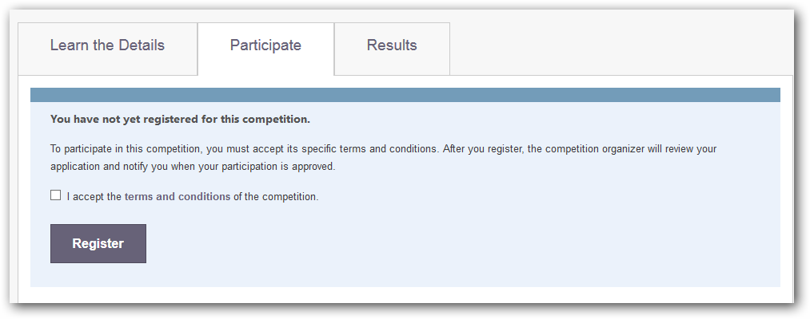

# Participating in a Competition
This document explains how to participate in CodaLab competitions.

## Contents

- [Viewing Current Competitions](#viewing-current-competitions)
- [Registering for a Competition](#registering-for-a-competition)
- [Making a Submission](#making-a-submission)
- [Viewing Competition Results](#viewing-competition-results)

## Viewing Current Competitions
All of the current competitions are listed on the [CodaLab Competitions Page](https://www.codalab.org/competitions). Click a competition to get more information, including details such as the data formats required by the competition organizer. 

## Registering for a Competition
When you register for a competition on CodaLab.org, a request is sent to the competition organizer. You will be notified when the competition organizer has approved your registration request.

**To register for a competition**

1. [Sign in to CodaLab](https://www.codalab.org/accounts/login/). If you do not have an account you will need to [create one](https://www.codalab.org/accounts/signup/).
1. Visit the [CodaLab Competitions Page](https://www.codalab.org/competitions).
1. Select the competition you would like to join.
1. Click the **Participate** tab.

    

1. Check the box to accept the terms and conditions, then click **Register** to submit your registration request to the competition organizer. 

    

Visit the [CodaLab dashboard](https://www.codalab.org/my/) to check on the status of competitions for which you have registered.

## Making a Submission
In this section you will learn how to make a submission to a CodaLab competition. Essentially this involves uploading a bundle (.zip archive) containing files with your answer, in the format that has been specified by the competition organizer.

**To make a submission**

1. [Sign in to CodaLab](https://www.codalab.org/accounts/login/). If you do not have an account you will need to [create one](https://www.codalab.org/accounts/signup/).
1. Visit the [CodaLab Competitions Page](https://www.codalab.org/competitions).
1. Select the competition you want to work with.
1. Click the **Participate** tab.

    

    Here, you can access the data that has been provided by the competition organizer.

1. Click **Submit/View Results**.

    

    On this page you can make new submissions, and see previous submissions for each phase in the competition.

1. Click **Submit Results...**. You will be prompted to select a submission bundle (.zip archive). Locate the bundle you want to submit and click **Open** to upload your submission.

    

    Now you will be able to see the details for the submission you just uploaded. The detail page for each submission includes links to download the submission bundle, view standard output and error logs, and download evaluation output.

    **IMPORTANT:** Your submission will not be active until you submit it to the leaderboard.

1. Click **Refresh status**, then click **Submit to Leaderboard**.

If there is an error with your submission, you can use the standard output and error logs to get more information.