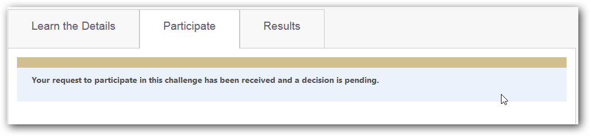

# Participating in a Competition
This document explains how to participate in CodaLab competitions.

## Contents

- [Viewing Current Competitions](#viewing-current-competitions)
- [Registering for a Competition](#registering-for-a-competition)
- [Making a Submission](#making-a-submission) (don't forget crucial step of submit to leaderboard).
- [Viewing Competition Results](#viewing-competition-results)

## Viewing Current Competitions
All of the current competitions are listed on the [CodaLab Competitions Page](https://www.codalab.org/competitions). Click a competition to get more information. 

## Registering for a Competition
When you register for a competition on CodaLab.org, a request is sent to the competition organizer. You will be notified when the competition organizer has approved your registration request.

**To register for a competition**

1. [Sign in to CodaLab](https://www.codalab.org/accounts/login/). If you do not have an account you will need to [create one](https://www.codalab.org/accounts/signup/).
1. Visit the [CodaLab Competitions Page](https://www.codalab.org/competitions).
1. Select the competition you would like to join.
1. Click the **Participate** tab.

    

1. Check the box to accept the terms and conditions, then click **Register** to submit your registration request to the competition organizer. 

    

Visit the [CodaLab dashboard](https://www.codalab.org/my/) to check on the status of competitions for which you have registered.

## Making a Submission
